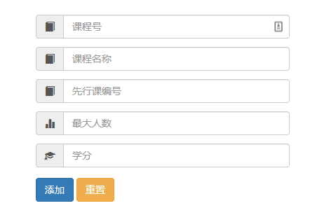

#用户教程
##本管理员系统拥有四大功能
#####1.用户管理
>本功能包含了学生的管理和教师管理，点开之后可以添加和修改学生教师

#####2.课程管理
>包含添加和课程和查看课程功能

#####3.学生信息管理
>包含了选课和成绩的管理

#####4.院系管理
>包含了添加和删除院系

###报表功能
以教师为例可以自由选择需要的列和搜索特定的信息
>
并且可以分页打印出需要的行数

